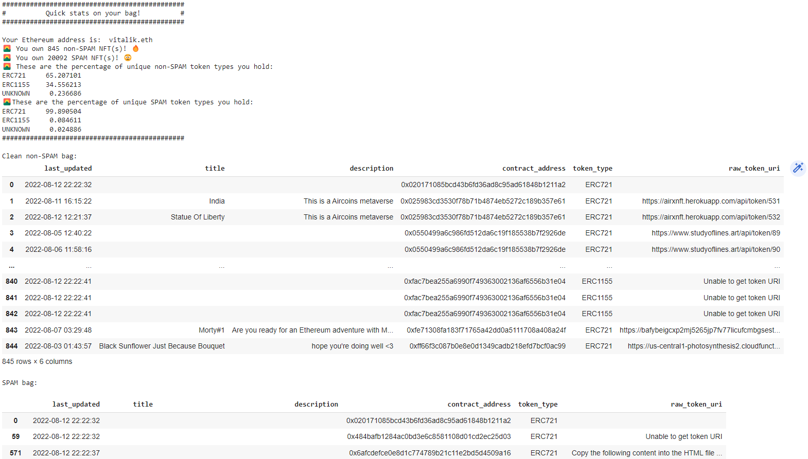

## On-chain NFT Data
This code pulls on-chain NFT data for a given wallet address or ENS name. 
The raw json data is normalized using `pandas.json_normalize` function and some simple analysis run on the data:
- How many SPAM vs non-SPAM NFTs are owned by the address
- Percentage of each token type (i.e. ERC721/ERC1155/UNKNOWN)
- 

Here's an example of NFTs held by `vitalik.eth` as of `8/12/2022`



## Installation Steps
My system setup:
- windows machine; windows guy here! (you can easily look up the equivalent commands for the systems you're working with)
- python 3.10.2 version
  
Clone the repository:

```
git clone https://github.com/tonykipkemboi/on-chain-nft-data
cd on-chain-nft-data
```
Setup a `virtual environment` by running the following commands in your `windows terminal`:

```
# This will create a on-chain-nft-data/venv folder
python -m venv venv

# Activate venv with the following command 
.\venv\Scripts\activate

# Add venv to your .gitignore
```

You can tell the environment is active by looking at your terminal prompt. 
It will look something of the sort. Note the `venv` part: 

```
(venv) computer:on-chain-data user$
```

Install the dependencies required to run the program by running this command:

``` 
pip install -r requirements.txt
```

Navigate to the file named `.env_example` and:
- rename it to `.env`
- add your [Alchemy API Key](https://www.alchemy.com/) in here `KEY="YOUR_ALCHEMY_API_KEY_GOES_HERE"`

Change directory into `app` folder to run the program as such;

```
# change directory to app
cd app

# run program
python runner.py
```
Alternatively, if you would like to play with the app in `Jupyter Notebook`, navigate to the root of the directory and type the command
```jupyter notebook``` in your terminal/command line. This assumes you have Jupyter Notebook configured in yor system, if not, consider downloading [Anaconda](https://www.anaconda.com/)

## Running the program

Make sure you're in the correct directory `main.py`

```
python main.py
```

For the `jupyter notebook`, run cells using `Ctrl + Enter` or using the run button on the UI.

After you're through and ready to close, `deactivate` the virtual environment by typing he following command

``` 
deactivate
```

## Improvements & Next Steps

More info in this file.


- The query for owners with a lot of NFTs is taking a couple of minutes to run, here's stats for running `vitalik.eth`
  ``` 
  Execution time: ~ 3 minutes 30 seconds
  Total NFTs (at time of query): 20937 
  ```
  The latency could be improved by implementing concurrency.
